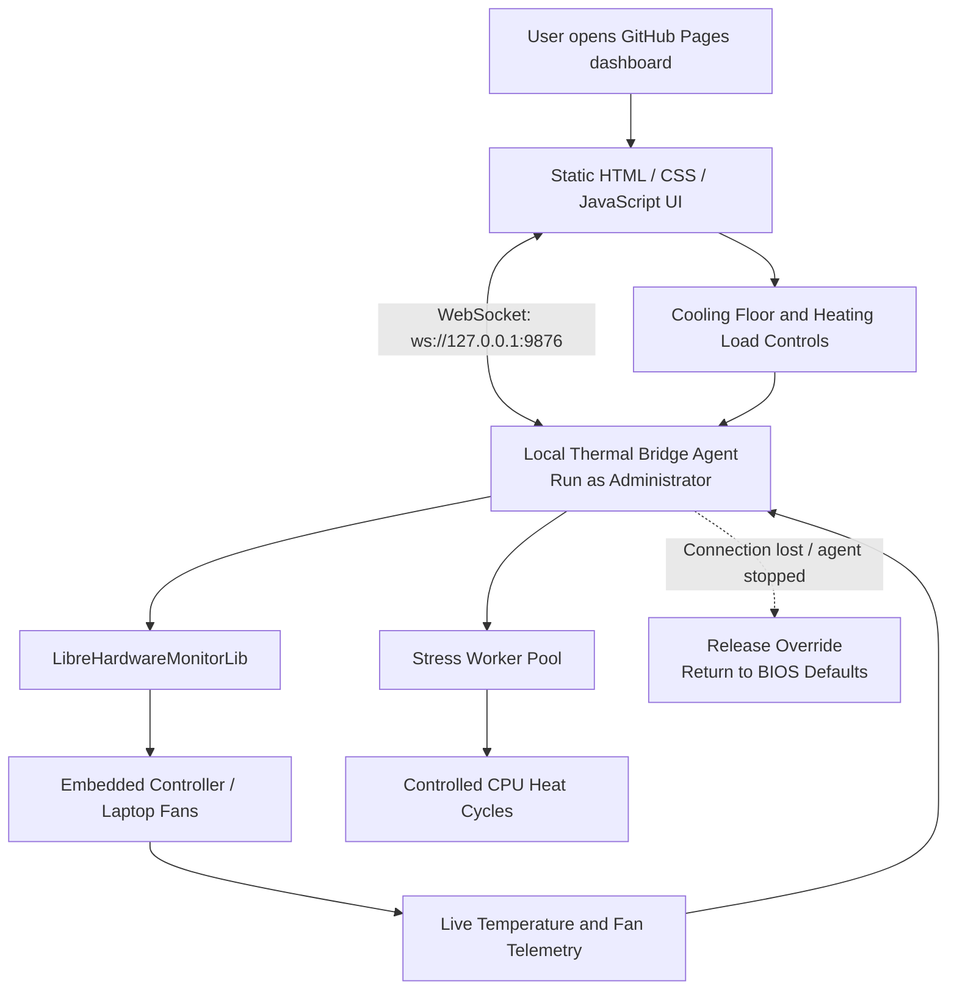
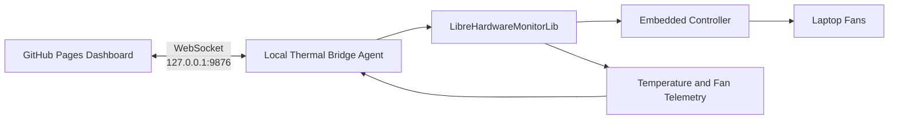
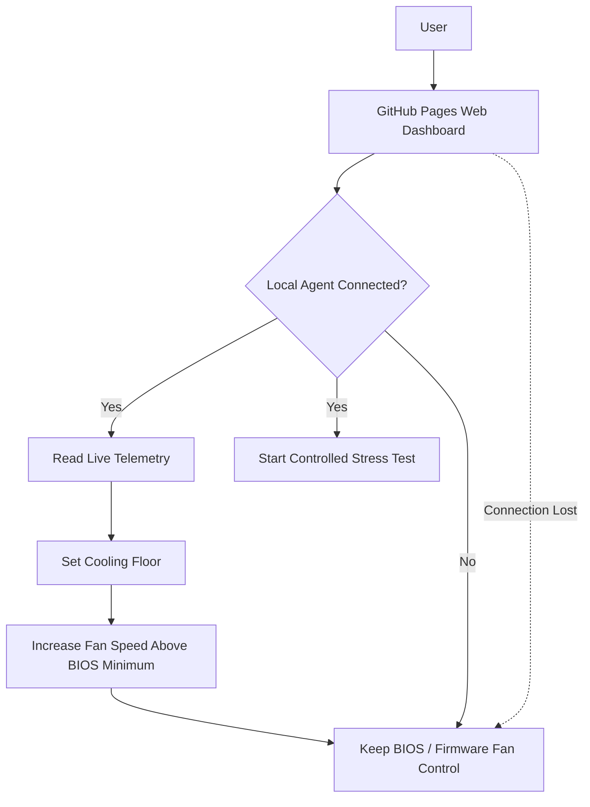

# ICASTFIREBALL


## Basic Details
### Team Name: THAATHA


### Team Members
- Team Lead: ADWAITH H A - TKM College of Engineering, Kollam
- Member 2: AAISHA SIDHIK - TKM College of Engineering, Kollam

### Project Description
Laptop Thermal Control Bridge connects a GitHub Pages dashboard to a lightweight local Windows agent. The dashboard provides live thermal telemetry, a configurable cooling-floor control, and an on-demand thermal stress test, while the local agent safely communicates with laptop hardware.
The web interface is hosted directly through GitHub Pages, and the standalone local agent is distributed through GitHub Releases.

### The Problem (that doesn't exist)
Your laptop’s firmware already manages its fans, but it refuses to let you micromanage them while you are compiling code, running benchmarks, or pretending that opening 47 browser tabs is a valid stress test.
The ridiculous problem: How can you manually demand more cooling from your laptop without building a full desktop application or surrendering your hardware controls to a mysterious cloud service?

### The Solution (that nobody asked for)
Laptop Thermal Control Bridge places a stylish browser dashboard in front of a local hardware-control agent. The browser handles the controls and visualisation; the local .exe handles the hardware interaction that browsers are not allowed to perform.
The system enforces a cooling floor only: it can raise fan speeds above the firmware default, but it will never reduce them below the BIOS safety curve. If the dashboard closes, the connection drops, or the agent stops, fan control immediately returns to the laptop’s default firmware behaviour.


## Technical Details
### Technologies/Components Used
For Software:
- Languages used: Python (local agent), JavaScript/TypeScript
- Frameworks used: FastAPI (local agent API), React or vanilla JS
- Libraries used: psutil, pywin32/OpenHardwareMonitor (thermal/fan access), requests/fetch (HTTP comms)
- Tools used: GitHub Pages (hosting), GitHub Releases (distribution), PyInstaller (executable bundling)

For Hardware:
- (Not applicable – this is a pure software project interfacing with existing laptop hardware.)

# Implementation
For Software:
## Installation
### Clone the repo
git clone https://github.com/bone-fires/thaatha

cd laptop-thermal-bridge
### Install agent dependencies
pip install -r requirements.txt
### Build the executable (optional)
pyinstaller --onefile agent.py

# Run
### Start the local agent
python agent.py
### Open the dashboard (GitHub Pages link)
### https://github.com/bone-fires/thaatha/releases/tag/finalv

### https://bone-fires.github.io/thaatha/

# Project Documentation
For Software:


The Fan Control V275 configuration interface showing a flat fan-speed setting of 52% and a graph-based fan curve. The screen also provides options to create, save, load, and manage fan-control configurations.


The Laptop Thermal Control Bridge web dashboard hosted on GitHub Pages. It provides the interface for connecting to the local agent, viewing laptop thermal information, and accessing the available cooling controls.


The thermal-control panel showing the local agent connection, cooling-floor settings, and controls for managing the laptop’s fan behaviour and running controlled heating tests.


# Diagrams
## Workflow Diagram



This workflow shows how the GitHub Pages dashboard communicates with the local thermal-control agent, monitors laptop hardware, manages fan speed, and safely returns control to the BIOS if the connection is lost.


# Schematic & Circuit

## Circuit Diagram


The GitHub Pages dashboard communicates with the local thermal-control agent through a WebSocket connection. The agent uses LibreHardwareMonitorLib to read telemetry and communicate with the laptop’s Embedded Controller and fans.

## System Schematic



The schematic shows the complete control flow. The agent can increase fan speed above the BIOS safety minimum, but if the dashboard connection is lost or the agent stops, all overrides are released and control returns to the firmware.


# Build Photos


### Components shown:
- Laptop Thermal Control Bridge local agent console
- Local Windows terminal / command prompt
- CPU temperature sensor: CPU Package
- Fan-control channel detection
- Local WebSocket server running at `ws://127.0.0.1:9876`
- Dashboard connection status
- Automatic fan-control restoration message
- Cooling-floor control set to 35%
- Thermal-control status and diagnostic logs


### Build steps:
1. Developed the local thermal-control agent using C# and .NET 8.
2. Integrated `LibreHardwareMonitorLib` to read CPU temperature and laptop fan data.
3. Implemented a WebSocket server on `ws://127.0.0.1:9876` for communication with the dashboard.
4. Added cooling-floor controls that allow the fan speed to be increased above the BIOS safety curve.
5. Added a controlled stress-worker pool for generating CPU heat during testing.
6. Created the static HTML, CSS, and JavaScript dashboard and hosted it using GitHub Pages.
7. Connected the dashboard to the local agent and tested live telemetry, dashboard connections, fan-control commands, and automatic restoration of BIOS fan control when the connection is lost.
8. Built and distributed the standalone Windows executable through GitHub Releases.


### Final build:
The final build is a complete Laptop Thermal Control Bridge consisting of a GitHub Pages web dashboard and a local Windows thermal-control agent. The dashboard provides a simple interface for monitoring laptop temperature, checking the agent connection, setting a minimum cooling floor, and starting controlled heating tests.
The local agent runs on the laptop with Administrator privileges and communicates with the dashboard through a WebSocket connection at `ws://127.0.0.1:9876`. It uses `LibreHardwareMonitorLib` to access hardware telemetry and communicate with the Embedded Controller and laptop fans.
The completed system allows users to:
- Monitor live CPU temperature and fan telemetry.
- Set a minimum fan-speed percentage.
- Run controlled CPU stress tests.
- Increase fan speeds above the BIOS safety curve.
- Automatically restore normal BIOS fan control if the dashboard disconnects or the agent is closed.
The final build is distributed as a standalone `LaptopThermalBridge.exe` file through GitHub Releases, while the web dashboard is hosted through GitHub Pages.


## Device Permissions, Requirements, and Workarounds

### Supported environment

The local agent is intended for:

- Windows 10 or Windows 11
- 64-bit x86 laptops
- A .NET 8 Windows-compatible runtime, unless using the self-contained release
- Hardware that exposes readable temperature/fan sensors
- Hardware whose embedded controller permits fan-control writes

The current fan-control implementation is Dell-specific. Dell Inspiron and XPS models are the primary target. Lenovo, ASUS, and generic devices may expose telemetry but are not guaranteed to support fan overrides.

### Required permissions

The agent must run as Administrator. The application manifest requests elevation automatically.

Administrator access is required because the agent:

- Loads the bundled low-level hardware access driver
- Reads hardware sensors through LibreHardwareMonitor
- Communicates with the laptop's embedded controller
- Writes fan-control values through the Dell SMBIOS interface
- Creates a local WebSocket listener on `127.0.0.1:9876`

When Windows displays the User Account Control prompt, select **Yes**. If the agent is started without elevation, it exits and displays an administrator error.

No internet access is required by the agent after it has been downloaded. The dashboard may be hosted online, but hardware telemetry is sent only to the local browser through the loopback WebSocket.

### Required files

The published package must include the executable and its required native support files. Do not separate or delete files from the release package unless they have been embedded successfully into the published executable.

At minimum, verify that the release package contains:

- `icastfireball.exe`
- `DellSmbiosBzhLib.dll`, if it is not embedded or copied into the publish output
- `bzh_dell_smm_io_x64.sys`

If the driver or DLL is missing, the agent may fail during startup or may be unable to control the fans.

### Windows security workarounds

Some systems block low-level hardware drivers through Windows security features.

If the agent reports that the Dell SMBIOS bypass driver could not be loaded:

1. Open **Windows Security**.
2. Open **Device security**.
3. Open **Core isolation details**.
4. Temporarily disable **Memory integrity**.
5. Restart Windows.
6. Run the agent again as Administrator.

Only disable Memory integrity if the device owner understands and accepts the security trade-off. Re-enable it when the agent is no longer needed. If the organization manages the device, this setting may be locked by policy; do not bypass organizational security controls.

Windows Defender, SmartScreen, or third-party antivirus software may quarantine or block the driver because it performs privileged hardware access. Use only a trusted, signed release and review any security warning carefully. Do not disable antivirus protection globally. If necessary, ask the device administrator to approve the verified application and driver.

### Browser and dashboard requirements

The dashboard must be opened from an allowed origin. The agent accepts:

- The configured GitHub Pages origin
- `localhost`
- `127.0.0.1`
- Empty origin requests used by some local test clients

The browser connects to:

```text
ws://127.0.0.1:9876/
```

## Team Contributions
- Adwaith H A: Local agent development (Python/FastAPI), hardware interfacing, executable packaging
- Aaisha Sidhik: [Specific contributions] Dashboard UI/UX, GitHub Pages deployment, documentation 
---
Made with ❤️ at TinkerHub Useless Projects 


